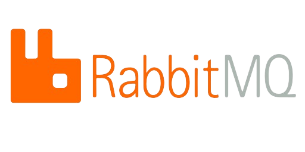

# RabbitMQ 

  <reportTable style="width: 80%;">
    <tr>
     <td></td>
    </tr>
  </reportTable>

## Introduction

In most modern applications, we are moving towards using microservices. Since microservices have many independent services, the connections between them become very large and complicated.

We can't use request/response-based systems here because applications usually wait for a response from another service. If a client triggers a slow service that needs a lot of computing power, it can make the application unresponsive, affecting the user experience.

Because of these issues, we need asynchronous communication between microservices. Message Based Systems can help with this. They use a component called a **Message Broker** to handle communication between services instead of letting them communicate directly.

  <reportTable style="width: 80%;">
    <tr>
     <td></td>
    </tr>
  </reportTable>

Message Brokers aid in decoupling applications as they are not directly interacting with each other.  Each application only needs to adhere to the data format of this Message Broker,making it easier to add different types of applications to the system.
Message Brokers can queue messages, letting web servers respond quickly without handling time-consuming tasks right away. Message queuing is also useful for sending messages to multiple consumers or balancing the workload between workers.

## RabbitMQ

RabbitMQ is an extremely popular open-source Message Broker used for building message-based systems. Although RabbitMQ supports multiple protocols, the most commonly used is AMQP.

AMQP 0–9–1 (Advanced Message Queuing Protocol) is a messaging protocol that enables conforming client applications to communicate with conforming messaging middleware brokers. It’s an application layer protocol that transmits data in binary format.

### Key Concepts

- **Producer**: A producer is an application that sends messages to the RabbitMQ server.
- **Consumer**: A consumer is an application that receives messages from the RabbitMQ server.
- **Queue**: A queue is a buffer that stores messages.
- **Exchange**: An exchange receives messages from producers and pushes them to queues on rules defined by the exchange type. A queue must be bound to at least one exchange to receive messages.
- **Binding**: A binding is a link between a queue and an exchange.
- **Routing Key**: A key that the exchange uses to decide how to route the message to queues. Think of the routing key as an address for the message.
- **Connection**:  TCP connection between your application and the RabbitMQ broker.

### RabbitMQ main components (Architecture)
RabbitMQ comes with the following 4 basic components:
- Producer
- Exchange
- Queue
- Consumer

  <reportTable style="width: 80%;">
    <tr>
     <td></td>
    </tr>
  </reportTable>

#### Producer
A producer is the user application that publishes the messages. We send our message from the publisher. The publisher will connect to RabbitMQ, send a single message, then exit.
When publishing a message, publishers may specify various message attributes (message meta-data). Some of these attributes can be consumed by RabbitMQ (broker) but many will be only consumed by the Receiver.
#### Exchange
The broker from the pub-sub mechanism is known as Exchange. It also has a Queue to store messages.

Exchanges take a message from the producer and route it into zero or more queues. The routing algorithm used depends on the exchange type and rules called bindings. This algorithm also has a routing key associated with it. It is nothing but a message attribute added to the message header by the producer. We can visualize the routing key as an “address” that the exchange is using to decide how to route the message. A message goes to the queue(s) with the binding key that exactly matches the routing key of the message.

There are the following types of exchange types:
- **Fanout exchange:** When we want to broadcast our message So that any queue can receive the message.

  <reportTable style="width: 80%;">
    <tr>
     <td></td>
    </tr>
  </reportTable>

- **Direct exchange:** When we have to send messages to queue only when specific key’s(routing key) value matches between them.

  <reportTable style="width: 80%;">
    <tr>
     <td></td>
    </tr>
  </reportTable>

- **Topic exchange:** Unlike Direct exchange, they match pattern instead of an exact key.

  <reportTable style="width: 80%;">
    <tr>
     <td></td>
    </tr>
  </reportTable>

- **Headers exchange:** The routing-key ignored completely and the message moved to the queue according to the header.

  <reportTable style="width: 80%;">
    <tr>
     <td></td>
    </tr>
  </reportTable>

- **Default exchange (nameless exchange):** Is unique only for RabbitMQ, the routing key is the queue name.

  <reportTable style="width: 80%;">
    <tr>
     <td></td>
    </tr>
  </reportTable>

#### Queue
A queue is message storage/buffer for RabbitMQ. When messages flow through RabbitMQ components, they can only be stored inside a queue.

Many producers can send messages that go to one queue, and many consumers can try to receive data from one queue. It is essentially only bound by the host’s memory & disk limits.

Before a queue can be used it has to be declared. Declaring a queue will cause it to be created if it doesn’t exist already. The declaration will have no effect if the queue does already exist and its attributes are the same as those in the declaration.

#### Consumer
A consumer is a program that mostly waits to receive messages (i.e. subscribed to the messages). Consumer listens for messages from RabbitMQ queues based on different policies attached. Whenever there are new messages in the queue that the receiver is listening to, it will be able to pull those messages from the queue in the sequence that they were inserted into that queue.

Also, when a new consumer is added, assuming there are already messages ready in the queue, deliveries will start immediately.

### Consumer Acknowledgements and Publisher Confirms
Since messages sent over the network are not guaranteed to reach the destination, RabbitMQ provides a delivery and processing confirmation mechanism. Delivery processing confirmation from the consumer to the broker is known as consumer acknowledgment. Broker confirmation to publish that message is received is known as publisher confirms.

Both can be positive and negative. Positive acknowledgment from consumers means a message is successfully processed, and negative means failures in processing. The same thing applies in case the publisher confirms.

RabbitMQ supports the acknowledgment of multiple messages at once.

### Advantages of RabbitMQ
- **Reliability:** RabbitMQ is indeed a reliable message broker. It supports message acknowledgments, ensuring that messages are not lost and can be redelivered if they are not acknowledged. This helps in maintaining message integrity and delivery.

- **Flexibility:** RabbitMQ supports multiple messaging protocols such as AMQP, STOMP, MQTT, and others. This makes it flexible and suitable for a wide range of applications and use cases.

- **Scalability:** RabbitMQ can be scaled both horizontally (by adding more nodes to a cluster) and vertically (by adding more resources to existing nodes). This scalability ensures that RabbitMQ can handle increased load and provide high availability and throughput.

- **Durability:** RabbitMQ can persist messages to disk, ensuring that messages are not lost in case of a broker restart. Additionally, it can replicate messages across multiple nodes in a cluster, providing redundancy and fault tolerance.

- **Management:** RabbitMQ comes with a management plugin that provides a web-based UI for managing and monitoring the broker. This UI allows users to monitor queues, exchanges, bindings, and more, making it easier to manage RabbitMQ instances.

- **Plugins:** RabbitMQ supports a wide range of plugins that can extend its functionality. These plugins can be used for monitoring, tracing, adding new protocols, and other features, enhancing RabbitMQ's capabilities.

- **Community:** RabbitMQ has a large and active community. This means there are plenty of resources available online, including documentation, tutorials, forums, and more, making it easier to learn and troubleshoot RabbitMQ.

### Best Practices
- **Design for Idempotency:** Ensure that message consumers can handle duplicate messages gracefully. This prevents issues if messages are redelivered.
- **Use Acknowledgments Properly:** Enable message acknowledgments to ensure that messages are processed and not lost. Configure consumers to acknowledge messages only after they have been successfully processed.
- **Leverage Durable Queues and Persistent Messages:** Use durable queues and mark messages as persistent to ensure that messages are not lost in case of broker failures or restarts.
- **Implement Dead Letter Exchanges (DLX):** Configure dead-letter exchanges to handle messages that cannot be processed (e.g., due to errors or timeouts). This helps in managing and debugging message issues.
- **Use Appropriate Exchange Types:** Choose the right type of exchange (direct, topic, fanout, headers) based on your routing requirements to ensure efficient message distribution.
- **Optimize Queue Length and Message Size:** Avoid very large queues as they can impact performance. Aim to process messages quickly and keep queues short. Also, keep message sizes small to reduce latency and improve throughput.
- **Monitor and Alert:** Set up monitoring and alerting for RabbitMQ to track metrics such as message rates, queue lengths, and system resource usage. Use RabbitMQ's management plugin or external monitoring tools like Prometheus and Grafana.
- **Secure RabbitMQ:** Implement security best practices such as using TLS for encrypted communication, setting up proper user permissions, and regularly updating RabbitMQ to the latest version.
- **Handle Network Partitions:** Configure RabbitMQ to handle network partitions using its built-in partition handling strategies. Choose the strategy that best fits your availability and consistency requirements.
- **Plan for Scaling:** Plan for horizontal scaling by setting up RabbitMQ clusters. Use load balancing and sharding techniques to distribute the load across multiple nodes.
- **Use Connection Pooling:** Use connection pooling to manage RabbitMQ connections efficiently. This helps in reducing the overhead of establishing connections and improves performance.
- **Optimize Consumer Concurrency:** Tune the concurrency of consumers to match the processing capacity of your application and the message throughput. Use multiple consumers to parallelize message processing.
- **Test Failures and Recovery:** Regularly test your RabbitMQ setup for different failure scenarios and ensure that your application can recover gracefully from failures.
- **Use Consistent Naming Conventions:** Adopt consistent naming conventions for exchanges, queues, and routing keys to make your RabbitMQ setup easier to manage and understand.
- **Documentation and Configuration Management:** Document your RabbitMQ setup, configurations, and usage patterns. Use configuration management tools to manage RabbitMQ configurations consistently across environments.

### Conclusion
Developing a message-based application using RabbitMQ facilitates asynchronous communication between multiple confirming parties. It has a wide set of configuration controls that can be fine-tuned based on your requirements. Some common use cases for RabbitMQ are multiplayer games, group chats, and background processing of tasks. To provide monitoring capabilities, RabbitMQ comes with a Management UI plugin that helps track useful metrics and provides useful insights into the system.

Note that this blog only focuses on the basic concepts of RabbitMQ and the best practices you should use while developing an application. You can always refer to [official documentation](https://www.rabbitmq.com/tutorials/amqp-concepts) for further details.

### An example of RabbitMQ with Spring Boot 
- [RabbitMQ with Spring Boot](https://github.com/Ibrah-salama/springboot-rabbitmq-example)